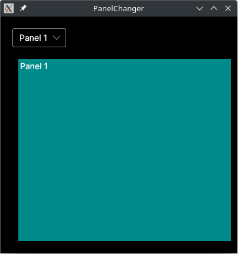
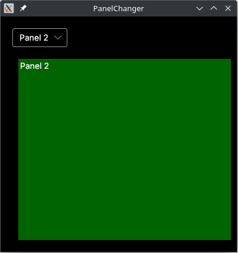

# AvaloniaPanelChanger

A way to change from one panel to another one in the same window.

For instance, you can change from the Panel 1...



...to the Panel 2 by means of changing the selection of the combo box.




## Build & Run

It can be edited in Rider or Visual Studio, but it can also be done from terminal.

```bash
$ cd src
$ dotnet run
```

